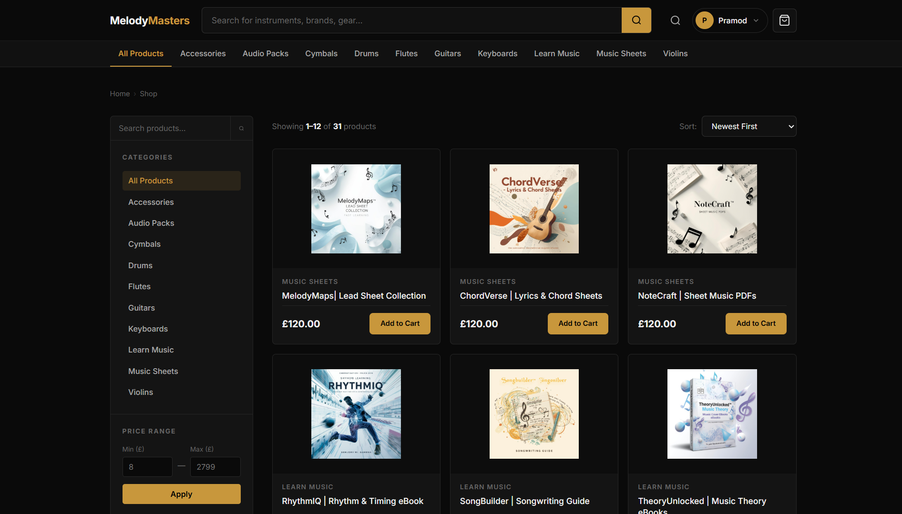
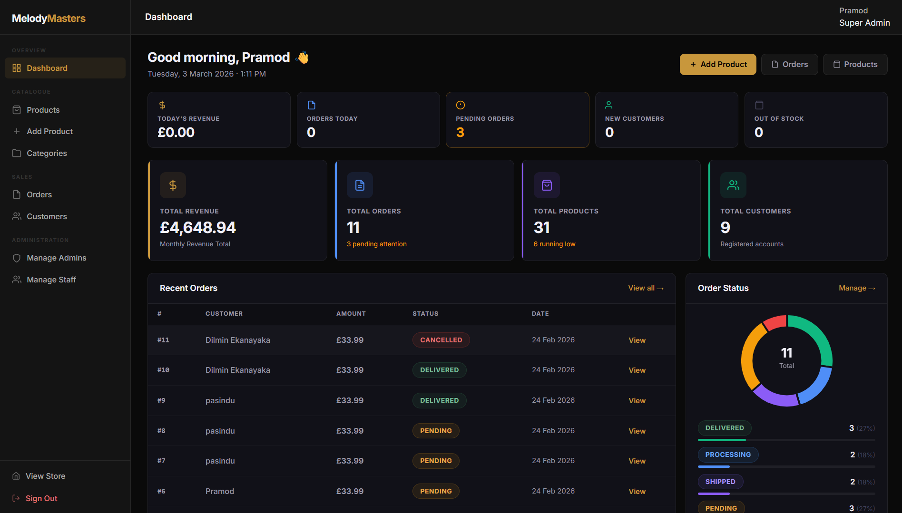

<div align="center">

# Melody Masters Online Store

**A modern, full-featured e-commerce platform for musical instruments.**

[](https://www.php.net/)
[](https://www.mysql.com/)
[](https://www.apachefriends.org/)
[](LICENSE)

</div>

---

## 📸 Screenshots

<div align="center">

| Homepage | Category Page |
|:-----------:|:----------------:|
|  |  |

| Admin Dashboard |
|:------------------:|
|  |

</div>

---

## 📖 Overview

**Melody Masters** is a fully-featured e-commerce web application built for a professional music instrument store. The platform supports both **physical** and **digital** products, a complete **admin dashboard** with live activity tracking, a **customer portal** with order history, and a **role-based access control** system.

---

## ✨ Features

### 🛍️ Customer Side
| Feature | Description |
|--------|-------------|
| **Product Catalog** | Browse instruments by category with filtering and sorting |
| **Smart Search** | Search products by name or category |
| **Product Reviews** | Star ratings and comments from verified buyers |
| **Shopping Cart** | Real-time cart with quantity management |
| **Smart Shipping** | Free shipping on orders over £100; per-product shipping rates |
| **Secure Checkout** | Address validation, order notes, COD & card payment options |
| **Digital Downloads** | Secure, download-limited file delivery for digital products |
| **Customer Account** | Profile management, avatar upload, order history |
| **Responsive UI** | Fully mobile-optimized for all screen sizes |

### 🛡️ Admin Side
| Feature | Description |
|--------|-------------|
| **Dashboard** | KPI cards, order charts, live activity feed, low-stock alerts |
| **Product Management** | Add, edit, and delete physical & digital products |
| **Category Management** | Hierarchical categories with physical/digital type |
| **Order Management** | View, filter, and update order statuses |
| **Customer Management** | View customer list with search |
| **Staff Management** | Create staff accounts with limited access |
| **User Management** | Superadmin-only: manage admin accounts |
| **Live Notifications** | Real-time bell drawer + toast notifications for new orders |

### 🔐 Role-Based Access Control
| Role | Access Level |
|------|-------------|
| `superadmin` | Full access — including managing admins & staff |
| `admin` | Full inventory & order management |
| `staff` | Orders & product viewing only |
| `customer` | Shop & customer portal only |

---

## 🛠️ Tech Stack

| Layer | Technology |
|-------|-----------|
| **Backend** | PHP 8.x |
| **Database** | MySQL / MariaDB |
| **Frontend** | HTML5, CSS3, Vanilla JavaScript |
| **Charts** | Chart.js (CDN) |
| **Fonts** | Google Fonts — Inter |
| **Server** | Apache (via XAMPP / WAMP / MAMP) |
| **Security** | Bcrypt password hashing, Prepared Statements, Session protection |

---

## 📁 Project Structure

```text
melody-masters-online-store/
│
├── index.php                  # Homepage
├── shop.php                   # Product listing & filtering
├── product.php                # Single product page
├── cart.php                   # Shopping cart
├── checkout.php               # Checkout & order placement
├── login.php                  # Sign in
├── register.php               # Create account
├── logout.php                 # Sign out & redirect
├── download.php               # Secure digital file download handler
│
├── admin/                     # Admin dashboard pages
│   ├── auth.php               # Role check & session guard
│   ├── layout.php             # Shared admin layout (sidebar, topbar, notifications)
│   ├── dashboard.php          # Main admin dashboard
│   ├── products.php           # Product list
│   ├── add_product.php        # Add new product
│   ├── edit_product.php       # Edit product
│   ├── categories.php         # Category management
│   ├── orders.php             # Order list
│   ├── order_detail.php       # Order detail view
│   ├── customers.php          # Customer list
│   ├── staff.php              # Staff management
│   ├── users.php              # Admin/Superadmin management
│   └── api_activity.php       # Live activity polling API
│
├── customer/                  # Customer portal pages
│   ├── account.php            # Profile & settings
│   ├── orders.php             # Order history
│   └── order-detail.php       # Order detail & download
│
├── includes/                  # Shared PHP helpers
│   ├── db.php                 # Database connection
│   ├── init.php               # Session start & global helpers
│   ├── header.php             # Site header component
│   └── footer.php             # Site footer component
│
├── assets/
│   ├── css/
│   │   ├── style.css          # Main site stylesheet
│   │   └── admin.css          # Admin-specific styles
│   ├── images/                # Product images, backgrounds, profile photos
│   │   └── profiles/          # User profile avatars
│   └── downloads/             # Uploaded digital product files
│
├── database/
│   └── database.sql           # Complete database schema + seed data
│
└── uploads/                   
```

---

## 🚀 Getting Started

### Prerequisites
- [XAMPP](https://www.apachefriends.org/) (or WAMP / MAMP / Laragon)
- PHP 7.4+ / 8.x
- MySQL / MariaDB

### Installation

**1. Clone the repository**
```bash
git clone https://github.com/dilminekanayaka/melody-masters-online-store.git
```

**2. Move to XAMPP web root**
```bash
# Place the project folder inside:
C:\xampp\htdocs\
```

**3. Create the database**
- Open your browser and go to: `http://localhost/phpmyadmin`
- Click **New** and create a database named `melody_masters_db`

**4. Import the database**
- Select `melody_masters_db` in phpMyAdmin
- Click the **Import** tab
- Choose the file: `database/database.sql`
- Click **Go**

**5. Configure database connection** (if needed)

Open `includes/db.php` and update if your credentials differ:
```php
$host     = "localhost";
$user     = "root";      
$password = "";          
$database = "melody_masters_db";
```

**6. Launch the application**

Open your browser and visit:
```
http://localhost/melody-masters-online-store
```

---

## 🔑 Default Admin Login

After importing the database, you can log in with these credentials:

| Field | Value |
|-------|-------|
| **Email** | `testadmin@gmail.com` |
| **Password** | `testadmin123`  |
| **Role** | `Admin` |


## 🔑 Staff Login


| Field | Value |
|-------|-------|
| **Email** | `teststaff@gmail.com` |
| **Password** | `teststaff123`  |
| **Role** | `Staff` |


---

## 🔒 Security Notes

- All database queries use **Prepared Statements** to prevent SQL Injection.
- Passwords are hashed using PHP's `password_hash()` with **Bcrypt**.
- Session tokens are validated on every admin page load.
- Digital file downloads are served securely through `download.php`, which verifies ownership before serving any file.
- Admin pages are protected with role-based guards — staff cannot access restricted pages.

---

## 📄 License

This project is licensed under the [MIT License](LICENSE).

---

<div align="center">

Made by the **Dilmin Ekanayake**

</div>
